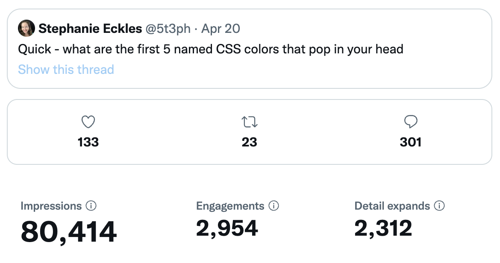

# "Popular" Named CSS Colors

This project plucks the data from replies to the tweet shown below which asked "Quick - what are the first 5 named CSS colors that pop in your head?".

For silliness only - although 300 responses was a pretty decent sample size!
